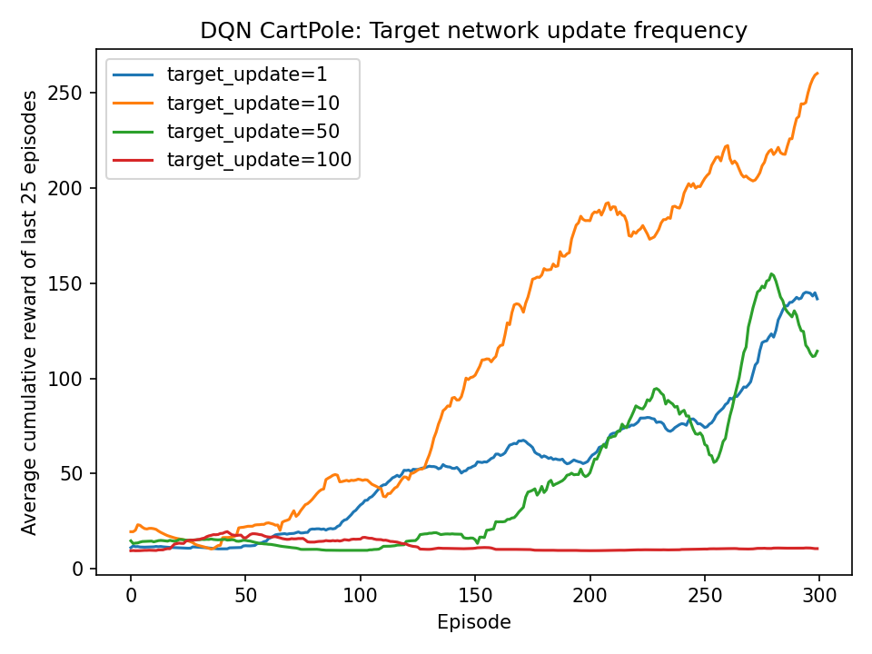
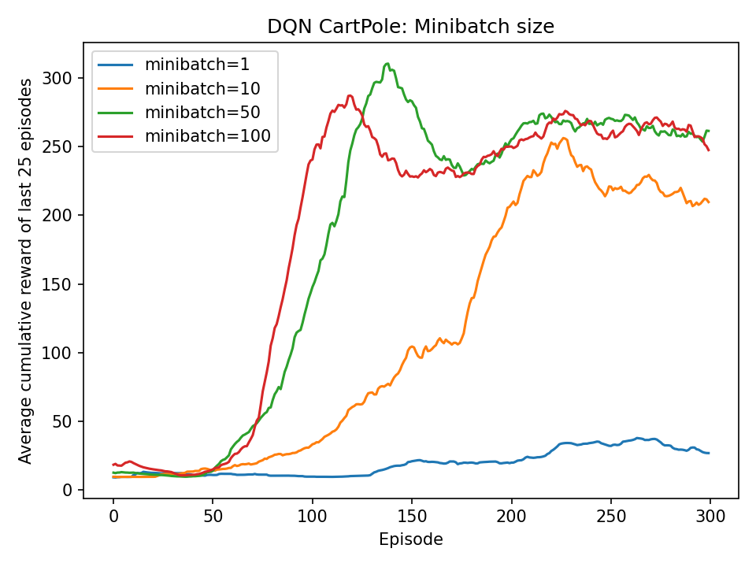

# Deep Q-Learning (CartPole)

## Setup

Trained Deep Q-Networks (DQN) on **CartPole-v1** (|S|=4, |A|=2, γ=0.99), using:

- Replay buffer size: 10,000  
- Hidden units: 512, 2-layer ReLU MLP  
- Optimizer: Adam (lr=5e-4)  
- Exploration: ε-greedy, annealed from 1.0 → 0.01 over 10,000 steps  
- Seeds: 5 (averaged)  
- Episodes: 300 per run  
- Metric: **average cumulative reward of last 25 evaluation episodes**

Two hyperparameters were swept:

1. **Target network update frequency**: {1, 10, 50, 100}  
2. **Minibatch size**: {1, 10, 50, 100}  

---

## Results — Target Network Update Frequency

- **Update=10**: fastest learning, stabilizes around 200+ reward by episode ~250.  
- **Update=50**: slower, still climbs above 150 reward by end.  
- **Update=1**: learns steadily but plateaus ~100 reward.  
- **Update=100**: fails to improve (rewards stuck near 10).  

**Interpretation.**  
The target network stabilizes bootstrapping. If updated too often (1), it chases Q’s noise; if updated too rarely (100), the targets are stale. Moderate update (10) balances stability and reactivity.

---

## Results — Minibatch Size (Using target update frequence of 10 based on previous results)

- **Batch=1**: Noisy and very slow; learning plateaus far below optimal performance.  
- **Batch=10**: Some learning, but convergence is still noisy and capped around ~200 reward.  
- **Batch=50**: Strong, fast improvement; performance surges quickly past 250 reward and stabilizes.  
- **Batch=100**: Similar to 50, with slightly earlier gains and high stability (~250–270 reward).  

**Interpretation.**  
Replay + minibatching stabilizes training by averaging updates over multiple experiences. With tiny batches (1–10), updates are too noisy, slowing convergence. Larger batches (50–100) provide smoother gradients, enabling rapid and stable learning. In this CartPole setup, **50–100** gave the best results, while very small batches underperformed.  

---

## Discussion

- **Target network.** This mechanism corresponds to “freezing” the Bellman backup target for several steps, akin to holding \(T^\pi V\) fixed in policy evaluation. Proper update frequency (≈10) gave the most stable convergence.  
- **Minibatch size.** Batches trade off variance reduction vs. update responsiveness. Too large (100) leads to very small gradient steps; too small (1) is noisy. Moderate values (10) yielded the best balance.  
- **Comparison to Part I & II.** Unlike DP and tabular Q-learning (which converge cleanly to optimal policies), DQN is sensitive to hyperparameters and unstable: collapse after early success (as with batch=50) is a known issue without further stabilizers (experience replay prioritization, double DQN, etc.).

---

## Conclusion

- **Target network frequency** is crucial: 10 ≈ sweet spot; too frequent/rare both hurt.  
- **Minibatch size** matters: small (10) works; extreme values fail.  
- Results highlight DQN’s sensitivity to stabilizing tricks absent in classical tabular methods.
