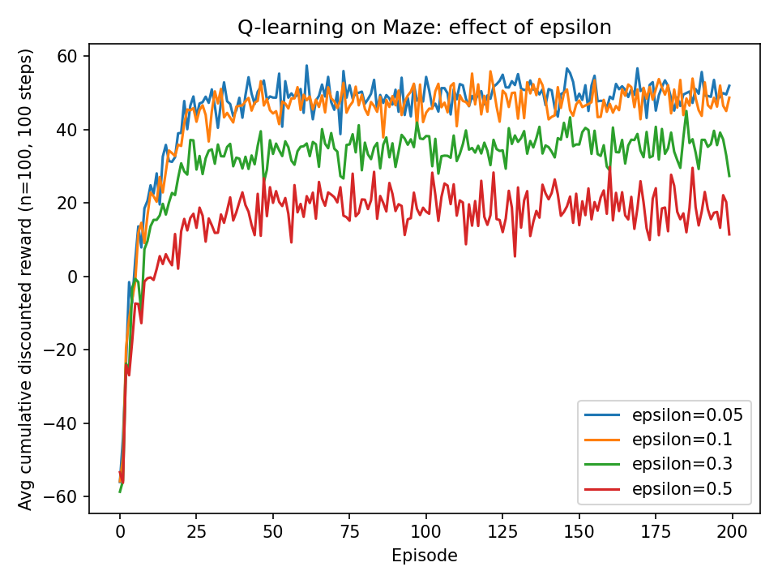

# CS885 — Assignment 1, Part II: Reinforcement Learning (Q-Learning)

## Setup

We apply Q-learning to two environments:

1. **Toy MDP (|S|=4, |A|=2, γ=0.9)** — sanity check.
2. **Maze (|S|=17, |A|=4, γ=0.95)** — the slip maze with absorbing end.
   - Initial state: s₀=0
   - Q₀=0 for all actions/states
   - α=0.1 (fixed in RL.py)
   - Episodes=200, Steps=100 each
   - ε ∈ {0.05, 0.1, 0.3, 0.5}, 100 trials each

Reward sampling used deterministic means (variance 0), so stochasticity came only from transitions and ε-exploration.

---

## Results — Toy MDP

- Learned policy (one run, 100×100 episodes/steps): **[0, 1, 1, 1]**.
- Q estimates (rounded):

```text
Action 0: [33.5702 31.3378 40.5737 44.4862]
Action 1: [27.6859 41.8599 42.8087 51.6445]
```

- Episode returns were noisy but quickly rose once good trajectories were sampled.

This matches expectations: Q-learning converges to a greedy policy matching Part I’s π*=[0,1,1,1].

---

## Results — Maze

### Learning curves (averaged over 100 trials)



- **ε=0.05 / 0.1**: Both curves climb quickly and stabilize around **~50 reward per episode**. Performance is highest and relatively stable.
- **ε=0.3**: Converges slower, plateaus lower (~35–40), with more variance.
- **ε=0.5**: Convergence is poor; average reward remains low (~20) and oscillatory.
- NOTE - "average cumulative discounted reward" means the expected total discounted return per episode, averaged across 100 independent learning runs, as a function of training episode index. For different epsilon values, choices are more chaotic and the agent did not learn as good of a strategy.
- With more episodes, the agent ALWAYS learned, but its learning reached greater heights with lower epsilon values.

### CSV data

Saved in `rl_maze_avg_returns.csv`, giving per-episode averages for each ε across 100 trials.

---

## Discussion

- **Exploration trade-off.**
  - Small ε (0.05–0.1) provided just enough exploration to discover good policies, then exploited them.
  - Large ε (0.3–0.5) forced too much randomness: the agent kept wandering into the bad state (−70) and delayed convergence.

- **Comparison with Part I (Dynamic Programming).**
  - DP (VI/PI/MPI) gave the **true optimal policy** deterministically.
  - Q-learning approximates this from samples: with careful exploration (ε small but >0) it reached near-optimal policies.
  - High ε prevented the greedy policy from locking in, showing the practical instability of model-free RL versus model-based DP.

- **Variance.**
  Even averaged over 100 trials, higher ε curves are visibly noisier — exploration randomness accumulates.

---

## Conclusion

- Q-learning successfully recovers near-optimal performance in the maze with small ε.
- There is a **sweet spot** around **ε≈0.1**, balancing exploration to escape local traps without wasting steps on random moves.
- Larger ε significantly harms final performance.
- Results confirm the theoretical expectation: ε-greedy exploration must decay or be tuned carefully for efficient learning.
